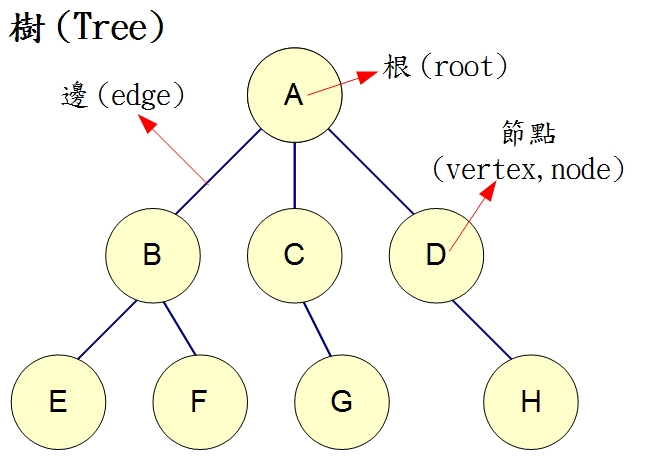

# 廣度優先搜尋(Breadth-First-Search)

* 又譯作寬度優先搜尋，或橫向優先搜尋，是一種圖形搜尋演算法。簡單的說，BFS是從根節點開始，沿著樹的寬度遍歷樹的節點。如果所有節點均被存取，則演算法中止。

## 方法

1. 將根節點加入佇列中
2. 從佇列中取出第一個節點，並檢查此節點是否是目標，如果是目標則結束搜尋，回傳結果
3. 將此節點所有未檢查過的子節點加入佇列
4. 若佇列為空，則結束搜尋並回傳結果，否則重複步驟2、3

## 以圖為例



1. 將A加入佇列中
2. 取出A並將A所有未檢查過的子節點B、C、D加入佇列中
3. 取出B並將B所有未檢查過的子節點E、F加入佇列中
4. 取出C並將C所有未檢查過的子節點G加入佇列中
5. 取出D並將D所有未檢查過的子節點H加入佇列中
6. 因為E、F、G、H皆無子節點，因此將他們依序取出後佇列為空

* 以此圖來說，存取順序為A、B、C、D、E、F、G、H

## 程式碼解說


* 一開始先將佇列放入1，取出佇列第一個值，檢查是否有被檢查過，如果未被檢查過則先標示成已檢查，接著將他所有未被檢查過的子節點放入佇列中，接著再取出佇列第一個值並重複前面的步驟

```
PS C:\Users\a\Desktop\ai107b\BFS> node bfs
bfs:1=>2=>5=>3=>4=>6=>
```

參考資料 :

1. 深度與廣度搜尋法 :
https://misavo.com/view/ai/search_jscode.md

2. 廣度優先搜尋法 :
http://simonsays-tw.com/web/DFS-BFS/BreadthFirstSearch.html

3. 廣度優先搜尋 :
https://zh.wikipedia.org/wiki/%E5%B9%BF%E5%BA%A6%E4%BC%98%E5%85%88%E6%90%9C%E7%B4%A2