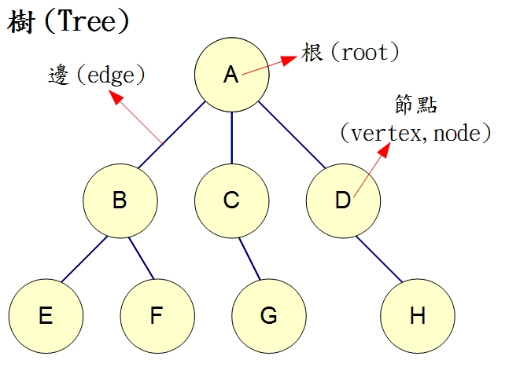

# 深度優先搜尋(Depth-First-Search)

* 是一種用於遍歷或搜尋樹或圖的演算法，沿著樹的深度遍歷樹的節點，儘可能深的搜尋樹的分支。當節點v的所在邊都己被探尋過，搜尋將回溯到發現節點v的那條邊的起始節點。這一過程一直進行到已發現從源節點可達的所有節點為止。如果還存在未被發現的節點，則選擇其中一個作為源節點並重複以上過程，整個行程反覆進行直到所有節點都被存取為止。屬於盲目搜尋。

## 方法

1. 首先取得根節點
2. 如果此節點為目標則結束搜尋，回傳結果
3. 檢查此節點是否有尚未檢查過的子節點，並取得第一個未檢查的子節點
4. 重複步驟2、3
5. 如果不存在尚未檢查過的子節點，取得上一層節點，並重複步驟2、3
6. 重複步驟4
7. 若整張圖都檢查過了，結束搜尋，並回傳結果

## 以圖為例

1. 取得根節點A
2. 發現B為第一個尚未檢查的子節點，取得B
3. 發現E為第一個尚未檢查的子節點，取得E
4. E並沒有子節點，回上一層到B，發現F第一個未檢查過的子節點，取得F
5. F並沒有子節點，回上一層到B，此時B已經無未檢查過的子節點，回到A
6. 發現C為未檢查過的，取得C
7. 持續步驟直到所有節點被檢查過

* 以此圖來說，存取順序為A、B、E、F、C、G、D、H

## 程式碼解說(以走迷宮為例)

