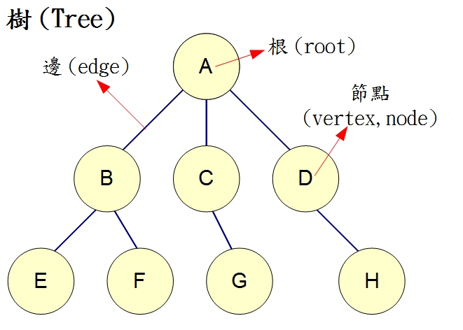

# 深度優先搜尋(Depth-First-Search)

* 是一種用於遍歷或搜尋樹或圖的演算法，沿著樹的深度遍歷樹的節點，儘可能深的搜尋樹的分支。當節點v的所在邊都己被探尋過，搜尋將回溯到發現節點v的那條邊的起始節點。這一過程一直進行到已發現從源節點可達的所有節點為止。如果還存在未被發現的節點，則選擇其中一個作為源節點並重複以上過程，整個行程反覆進行直到所有節點都被存取為止。屬於盲目搜尋。

## 方法

1. 首先取得根節點
2. 如果此節點為目標則結束搜尋，回傳結果
3. 檢查此節點是否有尚未檢查過的子節點，並取得第一個未檢查的子節點
4. 重複步驟2、3
5. 如果不存在尚未檢查過的子節點，取得上一層節點，並重複步驟2、3
6. 重複步驟4
7. 若整張圖都檢查過了，結束搜尋，並回傳結果

## 以圖為例



1. 取得根節點A
2. 發現B為第一個尚未檢查的子節點，取得B
3. 發現E為第一個尚未檢查的子節點，取得E
4. E並沒有子節點，回上一層到B，發現F第一個未檢查過的子節點，取得F
5. F並沒有子節點，回上一層到B，此時B已經無未檢查過的子節點，回到A
6. 發現C為未檢查過的，取得C
7. 持續步驟直到所有節點被檢查過

* 以此圖來說，存取順序為A、B、E、F、C、G、D、H

## 程式碼解說(以走迷宮為例)

* 一開始由起點開始向右，若遇到牆壁或已走過的路，則向下，若還是不可走向左，若還是不可走向上，若全部都不能走，則將目前位置標示成死路，並往回走一步看是否有其他可走的路，如此，直到找到出口(o為目前路徑，x為死路)

* 輸出結果有刪減，因為結果步驟太多

```
PS C:\Users\a\Desktop\ai107b> node dfs
------------------------
x=2 y=0
===============
== =     ======
     === ======
= ===       ===
=  =  == == ===
===== ===== ===
===     === ===
=== ===  == ===
===   == ======
===== =========
------------------------
x=2 y=1
===============
== =     ======
o    === ======
= ===       ===
=  =  == == ===
===== ===== ===
===     === ===
=== ===  == ===
===   == ======
===== =========
------------------------
x=2 y=2
===============
== =     ======
oo   === ======
= ===       ===
=  =  == == ===
===== ===== ===
===     === ===
=== ===  == ===
===   == ======
===== =========
------------------------
x=2 y=3
===============
== =     ======
ooo  === ======
= ===       ===
=  =  == == ===
===== ===== ===
===     === ===
=== ===  == ===
===   == ======
===== =========
.
.
.
------------------------
x=6 y=11
===============
== =ooooo======
ooooo===o======
= ===   oooo===
=  =  == ==o===
===== =====o===
===     === ===
=== ===  == ===
===   == ======
===== =========
------------------------
x=7 y=11
===============
== =ooooo======
ooooo===o======
= ===   oooo===
=  =  == ==o===
===== =====o===
===     ===o===
=== ===  == ===
===   == ======
===== =========
------------------------
x=4 y=8
===============
== =ooooo======
ooooo===o======
= ===   oxxx===
=  =  == ==x===
===== =====x===
===     ===x===
=== ===  ==x===
===   == ======
===== =========
------------------------
x=3 y=7
===============
== =ooooo======
ooooo===o======
= ===   oxxx===
=  =  ==x==x===
===== =====x===
===     ===x===
=== ===  ==x===
===   == ======
===== =========
.
.
.
------------------------
x=7 y=8
===============
== =ooooo======
ooooo===o======
= ===ooooxxx===
=  = o==x==x===
=====o=====x===
===  ooo===x===
=== ===o ==x===
===   == ======
===== =========
------------------------
x=8 y=8
===============
== =ooooo======
ooooo===o======
= ===ooooxxx===
=  = o==x==x===
=====o=====x===
===  ooo===x===
=== ===oo==x===
===   == ======
===== =========
------------------------
x=6 y=4
===============
== =ooooo======
ooooo===o======
= ===ooooxxx===
=  = o==x==x===
=====o=====x===
===  oxx===x===
=== ===xx==x===
===   ==x======
===== =========
------------------------
x=6 y=3
===============
== =ooooo======
ooooo===o======
= ===ooooxxx===
=  = o==x==x===
=====o=====x===
=== ooxx===x===
=== ===xx==x===
===   ==x======
===== =========
------------------------
x=7 y=3
===============
== =ooooo======
ooooo===o======
= ===ooooxxx===
=  = o==x==x===
=====o=====x===
===oooxx===x===
=== ===xx==x===
===   ==x======
===== =========
------------------------
x=8 y=3
===============
== =ooooo======
ooooo===o======
= ===ooooxxx===
=  = o==x==x===
=====o=====x===
===oooxx===x===
===o===xx==x===
===   ==x======
===== =========
------------------------
x=8 y=4
===============
== =ooooo======
ooooo===o======
= ===ooooxxx===
=  = o==x==x===
=====o=====x===
===oooxx===x===
===o===xx==x===
===o  ==x======
===== =========
------------------------
x=8 y=5
===============
== =ooooo======
ooooo===o======
= ===ooooxxx===
=  = o==x==x===
=====o=====x===
===oooxx===x===
===o===xx==x===
===oo ==x======
===== =========
------------------------
x=9 y=5
===============
== =ooooo======
ooooo===o======
= ===ooooxxx===
=  = o==x==x===
=====o=====x===
===oooxx===x===
===o===xx==x===
===ooo==x======
===== =========
------------------------
===============
== =ooooo======
ooooo===o======
= ===ooooxxx===
=  = o==x==x===
=====o=====x===
===oooxx===x===
===o===xx==x===
===ooo==x======
=====o=========
```

參考資料 :

以深度優先搜尋解決老鼠走迷宮問題 :
https://misavo.com/view/ai/search_dfs_mousepath.md

深度優先搜尋法 :
http://simonsays-tw.com/web/DFS-BFS/DepthFirstSearch.html