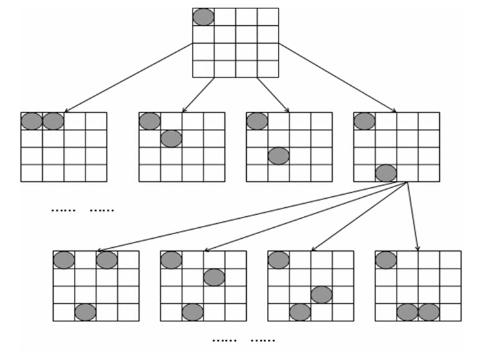

# 回溯法(Backtracking)

> * 回溯法採用試錯的思想，它嘗試分步的去解決一個問題。在分步解決問題的過程中，當它通過嘗試發現現有的分步答案不能得到有效的正確的解答的時候，它將取消上一步甚至是上幾步的計算，再通過其它的可能的分步解答再次嘗試尋找問題的答案。回溯法通常用最簡單的遞迴方法來實現，在反覆重複上述的步驟後可能出現兩種情況：
> 1. 找到一個可能存在的正確的答案
> 2. 在嘗試了所有可能的分步方法後宣告該問題沒有答案

## 程式碼解說(以四皇后問題為例)



* 首先定義一個4*4的陣列，令全部值為0，皇后為1，首先將一個皇后放在最左上角的位置，接著將第二個皇后放在第二排最上方，比對看是否會發生衝突，會衝突的話便將第二個皇后往下放一格，重複進行直到無衝突，接著放入第三個皇后，並依照前面的步驟擺放，放好以後會發現第四個皇后並沒有可以擺的位置，第四排的四格皆會有衝突，因此程式碼回到第一個皇后擺放的位置，將第一個皇后往下移一格，並繼續後面幾個皇后的擺放

```
No.1 slove way
0    1    0    0
0    0    0    1
1    0    0    0
0    0    1    0

No.2 slove way
0    0    1    0
1    0    0    0
0    0    0    1
0    1    0    0

solve count is 2
```

參考資料 :

1. 回溯法解決N皇后問題 :
https://www.cnblogs.com/xumenger/p/4311970.html

2. 回溯法 :
https://zh.wikipedia.org/wiki/%E5%9B%9E%E6%BA%AF%E6%B3%95